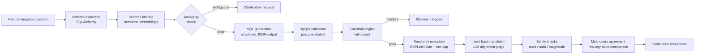

# **DBcraWler**

> **Natural-language questions → validated, guard-railed, read-only SQL over PostgreSQL.**

Most Text-to-SQL demos stop at *"the LLM wrote some SQL."* **DBcrawler** treats every LLM output as **untrusted input**: generated SQL must survive parsing, structural validation, a fail-closed guardrail engine, intent back-translation, sanity checks, and cross-query agreement — **before** it ever touches the database, which it can only read.


---

## Why this is different

| Typical demo | **DBcrawler** |
|---|---|
| Prompt LLM → run SQL | Prompt LLM → **validate → guardrail → verify → agree → score** → maybe run |
| Trusts the model's SQL | **Never executes SQL before guardrails** — by project rule, not preference |
| One DB user, full rights | Dedicated **`app_readonly` SELECT-only** user as a second defense layer |
| Confidence = what the LLM says | **Multi-signal confidence** where the LLM self-report is only **20%** of the weight |
| "It returned something" | **Deterministic sanity checks** + **hallucination detection** on every result |
| No safety story | **Fail-closed**: unknown constructs are blocked, not allowed |

---

## The pipeline

Every question flows through the same gauntlet:



<details>
<summary>ASCII version (click to expand)</summary>

```
                 ┌──────────────────────┐
 question ─────► │  schema extraction   │   SQLAlchemy introspection
                 └──────────┬───────────┘
                 ┌──────────▼───────────┐
                 │   schema filtering   │   nemotron embeddings + FK neighbors
                 └──────────┬───────────┘
                 ┌──────────▼───────────┐
                 │   ambiguity check    │── ambiguous ──► clarification
                 └──────────┬───────────┘
                 ┌──────────▼───────────┐
                 │    SQL generation    │   structured JSON (pydantic-validated)
                 └──────────┬───────────┘
                 ┌──────────▼───────────┐
                 │   sqlglot validator  │   postgres dialect, per-statement
                 └──────────┬───────────┘
                 ┌──────────▼───────────┐
                 │   GUARDRAIL ENGINE   │── block ──► blocked + logged
                 │      fail-closed     │
                 └──────────┬───────────┘
                 ┌──────────▼───────────┐
                 │  read-only execution │   EXPLAIN plan + scan-row cap
                 └──────────┬───────────┘
                 ┌──────────▼───────────┐
                 │ intent back-translation │  does the SQL mean the question?
                 └──────────┬───────────┘
                 ┌──────────▼───────────┐
                 │     sanity checks    │   rows / null-heavy / magnitude
                 └──────────┬───────────┘
                 ┌──────────▼───────────┐
                 │ multi-query agreement│   second SQL, row signatures
                 └──────────┬───────────┘
                 ┌──────────▼───────────┐
                 │  confidence breakdown│   transparent, per-signal
                 └──────────────────────┘
```

</details>

---

## Key engineering decisions

### 🔒 Defense-in-depth, not a single lock
Guardrails are the **first** layer, never the only one. Even if the guardrail engine had a hole, the database connection itself runs as `app_readonly` — a PostgreSQL user with **SELECT-only** grants, verified against DDL/DML attempts. A rollback transaction plus an `EXPLAIN`-based scan-row cap bound the cost of anything that does run.

### 🛡️ Fail-closed guardrail engine
DDL and DML statements are blocked. Subquery depth is capped. A `LIMIT` is **injected or clamped** on every statement. Anything the rules don't explicitly recognize is **blocked, not permitted** — and every block is logged.

### 🧠 Confidence you can audit
Confidence is a **weighted blend of local signals**, not vibes: intent back-translation alignment (0.35), deterministic sanity pass rate (0.25), LLM self-report (0.20), schema coverage (0.10), and multi-query agreement (0.10). Missing signals are dropped with renormalized weights — and a contradicting second query **zeroes out** the self-report.

### 🔍 Hallucination detection via back-translation
The generated SQL is translated **back into plain-language intent** and an independent LLM alignment judge compares it against the original question. If the SQL doesn't mean what was asked, the confidence drops — visibly, in the breakdown.

### 🤝 Multi-query agreement
For complex questions, the system asks for a **second, independent SQL** from the LLM, runs it through the *same* guardrail + execution path, and compares **row signatures**. Two independently-generated queries agreeing on results is strong evidence neither hallucinated.

### ⚖️ A real evaluation suite
A golden dataset ships in-repo: **42 verified SQL questions** (lookup / join / aggregation / date-range / top-N, all execute with non-empty results), plus **5 ambiguous**, **6 unanswerable**, and **8 dangerous statements** — of which **8/8 are blocked** by the guardrails in offline tests.

### 🔌 Model-agnostic by design
Model IDs come from **configuration, never hard-coded**. Structured output uses native `json_schema` with a robust fallback: parse JSON from prose, then retry with a JSON-only reminder — because free-tier auto-routed models don't always honor `response_format`.

---

## Architecture

```
src/dbcrawler/
├── schema/       SQLAlchemy extraction: tables, columns, types, PK/FK (incl. composite),
│                 sample values → structured SchemaRepresentation
├── pipeline/     prompt construction (glossary + few-shot), embedding-based
│                 schema filtering, ambiguity detection
├── llm/          OpenRouter client (chat + embeddings, retry + JSON fallback)
├── guardrails/   sqlglot validator + fail-closed guardrail engine + read-only executor
├── validation/   intent back-translation, sanity checks, multi-query agreement, runner
├── confidence.py multi-signal confidence scoring with transparent breakdown
├── api/          FastAPI service + shared pipeline service layer
├── ui/           Streamlit frontend (optional dependency group)
└── evaluation/   golden dataset, metrics, live runner
```

---

## Quick start

**1. Start PostgreSQL (seeded automatically):**

```bash
docker compose up -d
```

**2. Add your OpenRouter key** (`.env`, never committed):

```env
OPENROUTER_API_KEY=sk-or-...
```

**3. Install and run the demo:**

```bash
uv sync
uv run python -m dbcrawler.demo "How many customers are registered in Germany?" --execute
```

Ambiguity works too — this returns a clarification instead of guessing:

```bash
uv run python -m dbcrawler.demo "What is our revenue?"
```

**4. Or run the API:**

```bash
uv run uvicorn dbcrawler.api.app:app --port 8000
```

**5. Or the Streamlit UI** (optional extra):

```bash
uv sync --extra ui
uv run streamlit run src/dbcrawler/ui/streamlit_app.py
```

---

## API

| Endpoint | Method | Purpose |
|---|---|---|
| `/v1/query` | `POST` | Question → SQL + results + confidence breakdown |
| `/v1/schema` | `GET` | Database schema representation |
| `/v1/history` | `GET` | Session query history (newest first) |
| `/v1/feedback/{query_id}` | `POST` | Mark a result correct / incorrect |

Every response carries an explicit status: `ok`, `blocked`, `clarification_needed`, `execution_error`, or `generation_failed`. **An LLM failure never becomes a 500** — it degrades to a typed, honest status.

---

## Testing

67 tests covering guardrails (including **8/8 dangerous statements blocked**), the executor, validation, confidence, schema extraction, pipeline, API, and the evaluation dataset itself:

```bash
uv run pytest
uv run ruff check .
```

---

## Roadmap

- [x] Schema extraction, filtering, prompt construction
- [x] Guardrails + sandboxed read-only execution
- [x] Intent verification, sanity checks, multi-query agreement, confidence
- [x] FastAPI service + Streamlit UI
- [x] Golden evaluation dataset (offline-verified)
- [ ] Live evaluation numbers (re-running after free-tier LLM quota reset)
- [ ] Docker containerization of API + UI services

---

## Security principles

1. **Generated SQL is never executed before guardrails.**
2. **The execution user is read-only.** Guardrails are defense-in-depth, not the only protection.
3. **Unknown SQL constructs are blocked, not allowed.**
4. **Confidence is never claimed without validation signals.**
